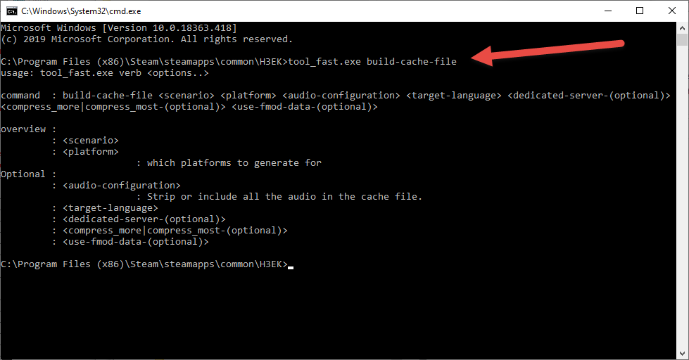
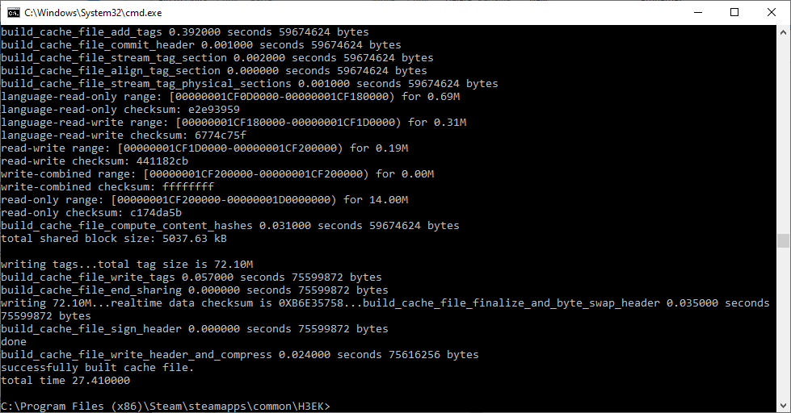
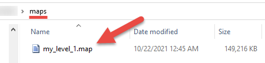

# Quick Start Process Step 9 - Creation of the MAP file

Now you have created your level and you can pack it into a MAP (**.map**) file. This file will contain all data of your level in the packaged form: its static geometry, shaders, .scenario file, and all necessary resources and tag files.

MAP files are generated by the **build-cache-file** command of **tool_fast** based on **.scenario** tag files.

To display possible parameters for this command, you can execute the **tool_fast.exe build-cache-file** command in the command prompt



Fig 1. tool_fast.exe build-cache-file without parameters command output.

As you can see, in its simplest form the command requires only the name of the **.scenario** file (without the extension) and the type of the target platform (e.g. **x64** for PC):

```
tool_fast.exe build-cache-file <scenario> <platform>
```

Where, by **\<scenario>** here we mean **\<path_to_level_from_the_"tags"_folder>* as before.

> [!NOTE]
> As before, you should open Command Prompt, proceed to the root folder of Halo 3 Editing Kit there (see Step #3 for details), and launch this command in it.

For example, in our case:

```
tool_fast.exe build-cache-file levels\mod_levels\my_level_1\my_level_1 x64
```

As before, this will display a lot of debug info (error and a lot of warnings).



Fig 2. tool_fast.exe build-cache-file with parameters command output.

As a result, in the root folder of Halo 3 Editing Kit, you will find the **maps** folder with the **.map** file of your level.



Fig 3. Newly created .map File.

This is the final step of our tutorial. You have passed all the way from the initial geometry in Blender to the final **.map** file and learned the basic modelling pipeline for Halo 3 levels in the process.

**Good Job!**

After that, you will need this **.map** file to generate a distribution package with the map, add info about the map there (logo, description, etc.), and upload the resulting package to Steam Workshop. After that, other players will be able to download your map and play on it.

However, this process will be performed using a separate tool and it will be described in another tutorial.
