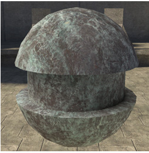
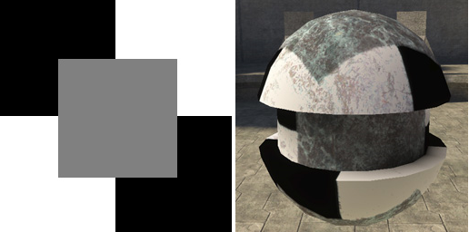
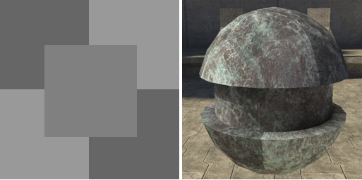
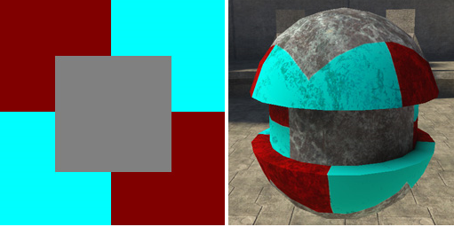
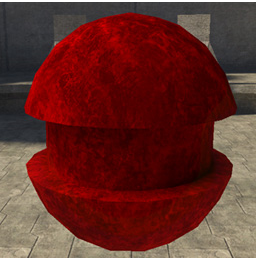
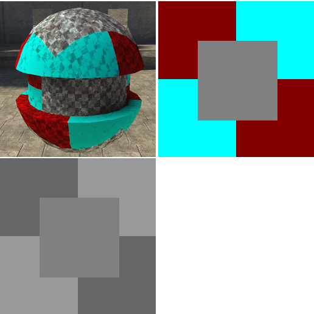

# Albedo Properties

**Albedo** (pronounced al-bee-doh) defines the surface color.

The alpha channel of the base_map (the first bitmap defined in the options below) can be used to control certain other operations in the shader. See specular_mask, material_model, alpha_test and blend_mode.

There are ten different options for albedo parameters.

- default

- detail_blend

- constant_color

- two_change_color

- four_change_color

- three_detail_blend

- two_detail_overlay

- two_detail

- color_mask

- two_detail_black_point

## **Default**

Basic color with one detail map.  Plus, you can tint the final color (the combination of the base and detail maps) using the albedo_color value. You can also adjust the final greyscale value of the combined alpha maps using the albedo_color_alpha value.

Figure 1 - Base map with no detail map.

Figure 2 - High contrast detail map and the high contrast detail map applied.

Figure 3 - Low contrast detail map and th elow contrast detail map applioed.

Figure 4 - Color detail map and the color detail map applied.

Figure 5 - Base map with 255 red albedo_color.

- base_map [bitmap] — Initial color map for surface. The lightmapper uses the color of the base_map for the color of bounced light projected from the surface.

- detail_map [bitmap] — Double multiplies the detail bitmap over the base map. The alpha channel is multiplied with the alpha channel of the base_map for operations requiring alpha information from albedo.

- albedo_color [color value] — Tints the albedo color.

- albedo_color_alpha [value] — Multiplies the grayscale values in the alpha channel by the value you supply. Darken the alpha by multiplying by a number smaller than one, brighten it using a number larger than one.

## **detail_blend**

Detail maps are applied based on the alpha channel of the base map, where black means full detail, and white means no detail. So the alpha channel of the base map acts as a sort of opacity map for the details.

- base_map [bitmap] — Initial color map for surface. The lightmapper uses the color of the base_map for the color of bounced light projected from the surface.

- detail_map [bitmap] — Double multiplies the detail bitmap over the base map, modulated by the alpha channel of the base map. Also, the alpha channel is multiplied with the alpha channel of the base_map for operations requiring alpha information from albedo.

- detail_map2 [bitmap] — Double multiplies the detail bitmap over the base map, modulated by the alpha channel of the base map. Also, the alpha channel is multiplied with the alpha channel of the base_map for operations requiring alpha information from albedo.

## **constant_color**

Constant color with a lovely shade of green

- albedo_color [color] — Initial color for surface.

- albedo_color_alpha [value] — Acts as alpha_channel for operations requiring alpha information from albedo.

## **two_change_color**

- base_map [bitmap] — Initial color map for surface. The lightmapper uses the color of the base_map for the color of bounced light projected from the surface.

- detail_map [bitmap] — Double multiplies the detail bitmap over the base map. Also, the alpha channel is multiplied with the alpha channel of the base_map for operations requiring alpha information from albedo.

- change_color_map [bitmap] — Red and green channels are multiplied with the base map. Change colors are specified in the object tag (.scenery, .crate, .biped, etc.). Red channel is primary change color, green channel is secondary change color.

## **four_change_color**

- base_map [bitmap] — Initial color map for surface. The lightmapper uses the color of the base_map for the color of bounced light projected from the surface.

- detail_map [bitmap] — Double multiplies the detail bitmap over the base map. Also, the alpha channel is multiplied with the alpha channel of the base_map for operations requiring alpha information from albedo.

- change_color_map [bitmap] — Red, green, blue, and alpha channels are multiplied with the base map. Change colors are specified in the object tag (.scenery, .crate, .biped, etc). Red channel is primary change color, green channel is secondary change color, blue is tertiary, alpha is quaternary.

## **three_detail_blend**

- Detail maps are applied based on the alpha channel of the base map, where black means full detail, and white means no detail.  So the alpha channel of the base map acts as a sort of opacity map for the details.

- base_map [bitmap] — initial color map for surface. The lightmapper uses the color of the base_map for the color of bounce light projected from the surface.

- detail_map [bitmap] — Double multiplies the detail bitmap over the base map, modulated by the alpha channel of the base map. Also, the alpha channel is multiplied with the alpha channel of the base_map for operations requiring alpha information from albedo.

- detail_map2 [bitmap] — Double multiplies the detail bitmap over the base map, modulated by the alpha channel of the base map. Also, the alpha channel is multiplied with the alpha channel of the base_map for operations requiring alpha information from albedo.

- detail_map3 [bitmap] — Double multiplies the detail bitmap over the base map, modulated by the alpha channel of the base map.  Alpha channel is double-multiplied with the alpha channels of the other two detail_maps for operations requiring alpha information from albedo.

## **two_detail_overlay**

- Documentation for this feature is coming soon.  

## **two_detail**

Basic color with two detail maps (see Figure 6).

Figure 5 - Base map with two detail maps (left), the color detail map (middle), and low contrast map (right).

- base_map [bitmap] — Initial color map for surface. The lightmapper uses the color of the base_map for the color of bounced light projected from the surface.

- detail_map [bitmap] — Double multiplies the detail bitmap over the base map. The alpha channel is multiplied with the alpha channel of the base_map for operations requiring alpha information from albedo.

- detail_map2 [bitmap] — Double multiplies the detail bitmap over the base and first detail map. The alpha channel is multiplied with the alpha channels of the base_map and detail_map for operations requiring alpha information from albedo.
