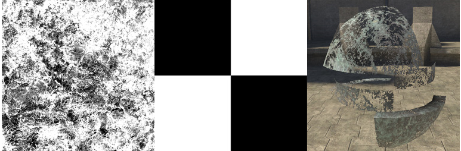

# Alpha Test Properties

Alpha Testing defines whether a pixel should be rendered or ignored.

> [!NOTE]
> This is different than alpha blending. With alpha test, the unused (not rendered) pixels are discarded, whereas they are still used in alpha-blend— thus making alpha test the cheaper solution.

Figure 1 - Two maps combined (left and middle) to affect an object (right).

There are two options for alpha test parameters: None and simple.

## **None**

[no parameters] — No alpha testing. This is the default setting.

## **Simple**

alpha_test_map [bitmap] — Modulates all other maps in the shader based on the color value of the alpha channel. Any pixel with a value less than 128 (50% gray) will not be rendered. Pixels with a value greater than 128 (50% gray) will be rendered on the screen. White in the alpha channel will render, Black will be transparent.

The alpha channels in both the base_map and the alpha_test_map are combined to determine which pixels get drawn and which do not. Grayscale values over 50% are drawn, under 50% are not. The RGB channels of the alpha_test_map are not used.
