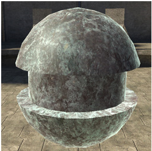
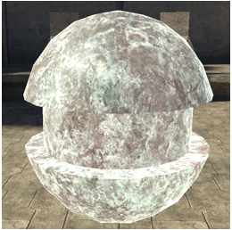
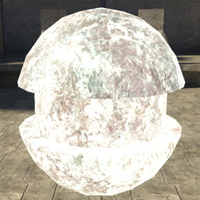
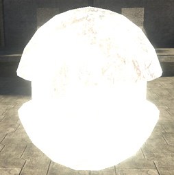

# Ambient Coefficient Properties

Adds non-directional light to the model overall, similar to self-illumination but scaled by the overall amount of ambient light in the environment. Good for keeping objects in dark environments from totally disappearing.

Figure 1 - ambient_coefficient: 0.

Figure 2 - ambient_coefficient: 0.5.

Figure 3 - ambient_coefficient: 1.

Figure 4 - ambient_coefficient: 2.
