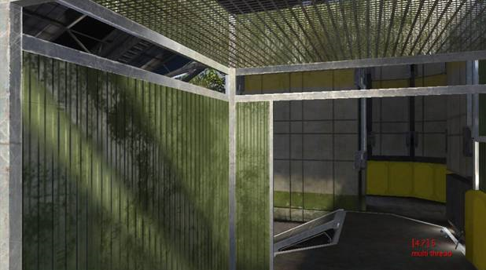
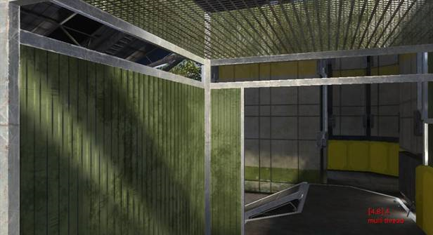

# Analytical Anti-Shadow Control Properties

This is a way to turn off unwanted analytical specularity in the shadows, which causes shadowy areas to appear brighter than the adjacent lit area.

The valid range is 0-1. 0 is default, meaning specularity is not attenuated at all. 1.0 is pretty aggressive attenuation, so aggressive that it might kill some portion of specularity even in the lit area. You should probably start from 0, and increase the value in small increments to find the sweet spot for your shader. Values in the range of 0.1 to 0.2 generally do the job.

Figure 1 - analytical_anti_shadow_control: 0 (default).

Notice the shadowy area on the left wall is actually brighter than the lit areas.

Figure 2 - analytical_anti_shadow_control: 0.15.

Looks much better.
