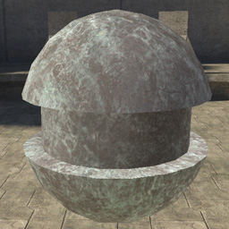
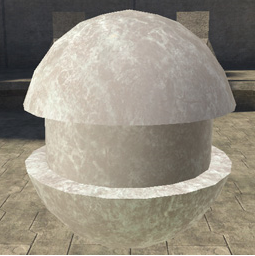
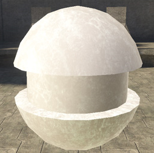
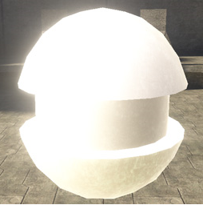
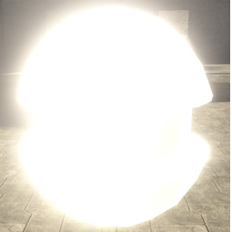

# Area Specular Contribution

Ambient lighting. Controls the amount of light cast onto the surface from all light sources in the area. Looks at all of the light probes in the area and calculates the amount and color of light that would be cast on the surface from each. Gives a very accurate representation of area lighting on the suface.

Defined by a value from 0-1, but higher numbers can be entered for special effects. A value of zero will result in no area specular at all. Low numbers work best.

Figure 1 -  area_specular_contribution: 0.1.

Figure 2 -  area_specular_contribution: 0.5.

Figure 3 -  area_specular_contribution: 1.

Figure 4 -  area_specular_contribution: 2.

Figure 5 -  area_specular_contribution: 5.
