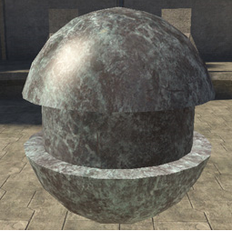
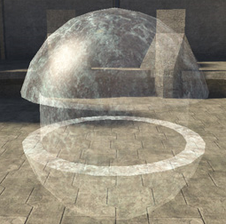
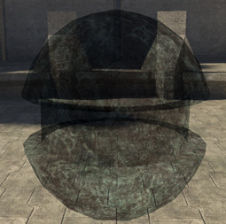
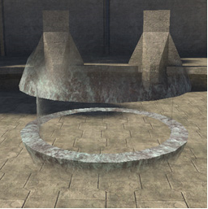
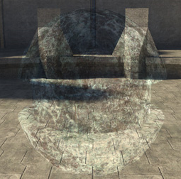

# Blend Mode

Defines how an object is added to the framebuffer (how it is blended with the objects behind it).

> [!NOTE]
> The Alpha Blend option uses the alpha channel of the base_map from the albedo.

See the table below for a comparison of how the different blend modes work.

**Blend Mode Comparison**

|**Blend Mode**|**Trasnparent Color**|**White Effect**|**Black Effect**|**50% Gray Effect**|
|---|---|---|---|---|
|**Additive**|Black|Force Framebuffer to White|Transparent|Saturate Framebuffer by 50%|
|**Multiply**|White|Transparent|Force Framebuffer to Black|Dim Framebuffer by 50%|
|**Double Multiply**|50% Gray|Brighten Framebuffer by 200%|Force Framebuffer to Black|Transparent|

> [!NOTE]
> Opaque and Alpha_blend blend modes are not included in the table because they are special cases.

There are multiple different blend modes:

- opaque

- additive

- multiply

- alpha_blend

- double_multiply

- pre_multiplied_alpha

## opaque 

[no parameters]— No transparency. This is the default setting.

Figure 1 -  Opaque.

## additive

[no parameters]— Reads from the RGB channels in the base_map of the albedo to determine pixel opacity in the scene. Black is completely transparent. As pixel values decrease, the pixels are rendered more transparent. As pixel values increase, they are rendered more opaque.

Figure 2 -  Additive.

## multiply

[no parameters]— Reads from the RGB channels in the base_map of the albedo to determine pixel opacity in the scene. White is completely transparent. As pixel values increase, the pixels are rendered more transparent. As pixel values decrease, they are rendered more opaque.

Figure 3 - Multiply.

## alpha_blend

[no parameters]— Blends the alpha channel and the RGB channels from the base_map of the albedo to determine the opacity of the pixels displayed. Darker values (0-128) in the alpha channel of the base_map in the albedo will make pixels more transparent. Lighter values (129-255) will result in more opaque pixel displays.

Figure 4 -  Alpha Blend.

## double_multiply

[no parameters]— Reads from the RGB channels in the base_map of the albedo to determine pixel opacity in the scene. 50% gray is completely transparent. As pixel values increase, they brighten the frame buffer (200% brighter with 255 white) and render more opaque. As pixel values decrease, they darken the frame buffer and render more opaque.

Figure 5 - Double Multiply.

## pre_multiplied_alpha

[no parameters]

Figure 6 -  Pre-Multiplied Alpha.
