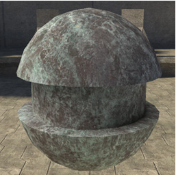
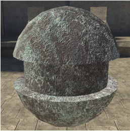
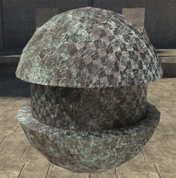

# Bump Mapping Properties

**Bump Mapping** defines variations in how lighting affects the surface.

Gives the illusion of a bumpy surface. This is based entirely on the Value (Lightness/Luminosity/Brightness) of each pixel in the red channel of the bitmap. Each pixel is compared to the one next to it. A large difference creates a deep line, small differences create subtle lines.  Specular highlights can also help to accentuate the bump effect.

Note: When authoring bump maps, you should always work in grayscale mode. The strength of the bump effect is controlled by two things: 1) the level of contrast in the bitmap itself, and 2) the bump map height value in the bitmap tag, higher numbers produce more pronounced bumpiness.

See also [Shader Parallax Properties](/Parallax.md).

There are three different options for bump mapping parameters:

## **off**

- **[no parameters]** — No bump mapping. This is the default setting.

Figure 1 -  Off.

## **standard**

- **bump_map** — [bitmap] differences in pixel values are used to determine vectors of lighting on the surface. This is based entirely on the Value (Lightness/Luminosity/Brightness) of each pixel in the red channel of the bitmap. Each pixel is compared to the one next to it. A large difference creates a deep line, small differences create subtle lines. When authoring bump maps, you should always work in grayscale mode.

Figure 2 -  Standard.

## **detail**

- **bump_map** — [bitmap] differences in pixel values are used to determine vectors of lighting on the surface. This is based entirely on the Value (Lightness/Luminosity/Brightness) of each pixel in the red channel of the bitmap. Each pixel is compared to the one next to it. A large difference creates a deep line, small differences create subtle lines. When authoring bump maps, you should always work in grayscale mode.

- **bump_detail_map** — [bitmap] a second bump_map (height map) for the surface.

Figure 3 -  Detail.
