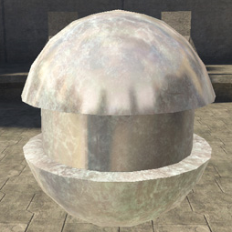

# Environment Specular Contribution

Reflection. Set this to 0 if you don't want the environment map to display.

Defined by a value from 0-1, but higher numbers can be entered. A value of zero will result in no reflection at all.

Figure 1 - environment_map_specular_contribution: 0.1.

Figure 2 - environment_map_specular_contribution: 0.5.

Figure 3 - environment_map_specular_contribution: 1.

Figure 4 - environment_map_specular_contribution: 2.

Figure 5 - environment_map_specular_contribution: 5.
