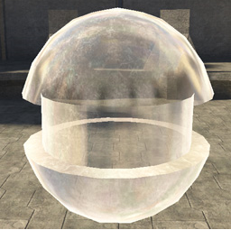
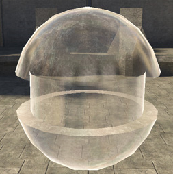
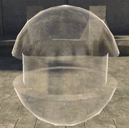
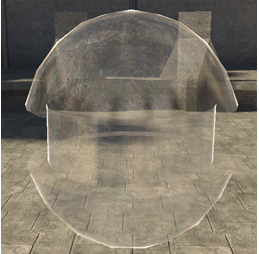

# Fresnel Curve Steepness

Controls how far the environment map wraps around from the edges of the model. A value of zero gives you uniform reflection across the model, the same as a non-glass shader. Higher value cause less reflection on the front of the mesh and keep it limited to the sides of the mesh (faces with their normals at 90 degrees to the camera).

Figure 1 - fresnel_curve_steepness: 1.

Figure 2 - fresnel_curve_steepness: 2.5.

Figure 3 - fresnel_curve_steepness: 5 (default).

Figure 4 - fresnel_curve_steepness: 10.
