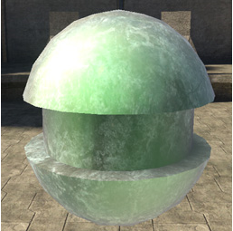
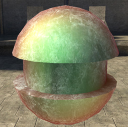

# Glancing Specular Tint Properties

The color of the specular lighting on mesh faces with normals pointing at 90 degrees to the camera.

Figure 1 - glancing_specular_tint: white (default).

Figure 2 - glancing_specular_tint: [255,0,0].
