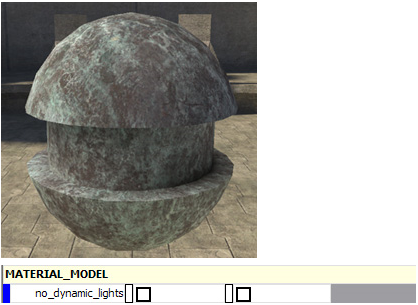
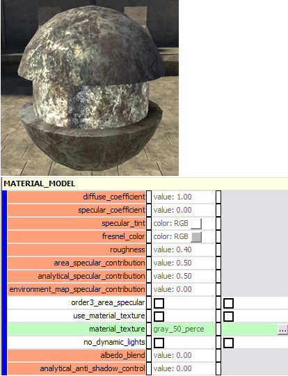
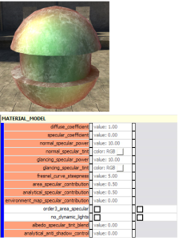
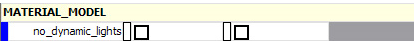
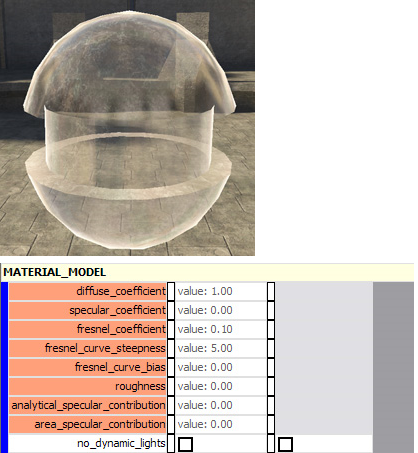
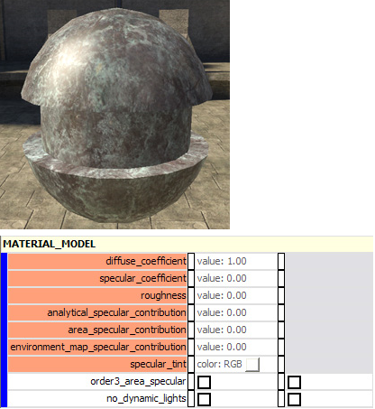

# Material Model Properties

Material Model defines what method is used to define specular properties.

> [!NOTE]
> Per-pixel control of the specular properties is defined in the [Specular Mask](../Shaders/SpecularMask.md). The source for the environment mapping is defined in [Environment Mapping](../Shaders/EnvironmentMapping.md) and can be set to none (which means that there will be no environment mapping, no matter what settings are in the Material Model)

## diffuse_only

This gives you diffuse color only, with no specularity.

Figure 1 - diffuse_only.

- **[no parameters]** — No specular properties. This is the default setting.

## cook_torrance

A good general purpose shader that gives you per-pixel control over specular, reflection, roughness, and albedo blend.

Figure 2 - cook_torrance.

- diffuse_coefficient [value]— Default: 1.0. Controls the amount of albedo base_map rendered on the surface.

- specular_coefficient [value]— Default: 0.0. Controls the overall amount of specular rendered on the surface.

- specular_tint [color]— Default: [255,255,255]. Multiplied with the fresnel_color to control the color of light reflected by the surface. Acts as a "clamp" on the color of light reflected.

- fresnel_color [color]— Default: [128,128,128]. Controls the color of light reflected by the surface in two ways: 1) multiplied by the specular_tint color, and 2) controls the glancing color of light by multiplying all values of the color by 255 (the color of direct, white light).

- roughness [value]— Default: 0.4. Defines the roughness of the surface. A higher value results in light being spread out across the surface. A small value results in small, pinpoint light on the surface (as if it was a smooth, shiny surface).

- area_specular_contribution [value]— Default: 0.5. Controls the amount of light cast onto the surface from all light sources in the area. Looks at all of the light probes in the area and calculates the amount and color of light that would be cast on the surface from each. Gives a very accurate representation of area lighting on the suface.

- analytical_specular_contribution [value]— Default: 0.5. Controls the amount of light cast onto the surface from the single brightest light source nearby. Looks at all of the light probes nearby and picks the single brightest light source. Casts only the light from that single source onto the surface— resulting in pinpoint specs of light.

- environment_map_specular_contribution [value]— Default: 0.0. Controls the environment map's contribution to the specular properties of the shader/surface. Set this to 0 if you don't want the environment map to display.

- order3_area_specular [on/off]— Default: off.

- use_material_texture [on/off]— Default: off. Specify whether or not the material texture bitmap is used.

- material_texture [bitmap] — Various specular properties are controlled by the RGB and Alpha channels of the specified bitmap.

- no_dynamic_lights [on/off]— Default: off.

- albedo_blend [value]— Default: 0.0. Blends between albedo base_map color and the specular tint and fresnel colors defined in the shader. 0 = more specular tint. 1 = more albedo/less specular tint.

- analytical_anti_shadow_control [value]— Default: 0.0. Controls the amount of light cast on the surface to defeat incorrect shadowing (caused by certain combinations of specular properties).

## two_lobe_phong

Dual control over specular strength and color.  Glancing specular (mesh normals parallel to the screen) can be adjusted seperately from direct specular (perpendicular to the screen).

Figure 3 - two_lobe_phong.

- diffuse_coefficient [value]— Default: 1.0. Controls the amount of albedo base_map rendered on the surface.

- ecular_coefficient [value]— Default: 0.0. Controls the overall amount of specular rendered on the surface.

- normal_specular_power [value] Default: 10.0. The amount of colored light that is reflected off of the surface when looking at it from a direct angle.

- normal_specular_tint [color]— Default: [255,255,255]. The color of light reflected off of the surface when viewing it directly.

- glancing_specular_power [value]— Default: 10.0. The amount of colored light that is reflected off of the surface when looking at it from a glancing angle.

- glancing_specular_tint [color]— Default: [255,255,255]. The color of light reflected off of the surface when viewing it from a glancing angle.

- fresnel_curve_steepness [value] Default: 5.0. The steepness of the curve at which normal tint color is turned to glancing tint color. A smaller number makes it easier to see the glancing color (sets glancing to a very wide range of angles). A larger number makes it easier to see the normal color (sets glancing to a very small— narrow— range of angles).

- area_specular_contribution [value]— Default: 0.5. Controls the amount of light cast onto the surface from all light sources in the area. Looks at all of the light probes in the area and calculates the amount and color of light that would be cast on the surface from each. Gives a very accurate representation of area lighting on the surface.

- analytical_specular_contribution [value]— Default: 0.5. Controls the amount of light cast onto the surface from the single brightest light source nearby. Looks at all of the light probes nearby and picks the single brightest light source. Casts only the light from that single source onto the surface— resulting in pinpoint specs of light.

- environment_map_specular_contribution [value]— Default: 0.0. Controls the environment map's contribution to the specular properties of the shader/surface. Set this to 0 if you don't want the environment map to display.

- order3_area_specular [on/off]— Default: off.

- no_dynamic_lights [on/off]— Default: off.

- albedo_specular_tint_blend [value]— Default: 0.0. Blends between albedo base_map color and the specular tint and fresnel colors defined in the shader. 0 = more specular tint. 1 = more albedo/less specular tint.

- analytical_anti_shadow_control [value]— Default: 0.0.

## foliage 

Figure 4 - foliage.

- no_dynamic_lights [on\off]— Default: off.

## glass

Mimics the behavior of glass where reflection is more pronounced on the sides of an object, and less so in the center where the faces are more parallel to the camera (also know as a Fresnel effect). Click on the fresnel links for more info. Also, this is specifically meant to be used with some kind of environment mapping. If there is no env map, the sides of the model will be black.

Figure 5 - glass.

- diffuse_coefficient [value]— Default: 1.0.

- specular_coefficient [value]— Default: 0.0.

- fresnel_coefficient [value]— Default: 0.1.

- fresnel_curve_steepness [value]— Default: 5.0.

- fresnel_curve_bias [value]— Default: 0.0.

- roughness [value]— Default: 0.0.

- analytical_specular_contribution [value]— Default: 0.0.

- area_specular_contribution [value]— Default: 0.0.

- no_dynamic_lights [on\off]— Default: off.

## organism

Figure 6 - organism.

- diffuse_coefficient [value]— Default: 0.0.

- diffuse_tint [color]— Default: [255,255,255]

- analytical_specular_contribution [value]— Default: 0.0.

- area_specular_contribution [value]— Default: 0.0.

- specular_tint [color]— Default: [255,255,255].

- specular_power [value]— Default: 10.0.

- specular_map [bitmap].

- environment_map_coefficient [value]— Default: 0.0.

- environment_map_tint [color]— Default: [255,255,255].

- fresnel_curve_steepness [value]— Default: 5.0.

- rim_coefficient [value]— Default: 1.0.

- rim_tint [color]— Default: [0,0,0].

- rim_power [value]— Default: 2.0.

- rim_start [value]— Default: 0.7.

- rim_maps_transition_ratio [value]— Default: 0.0.

- ambient_coefficient [value]— Default: 0.0.

- ambient_tint [color]— Default: [255,255,255].

- occlusion_parameter_map [bitmap].

- subsurface_coefficient [value]— Default: 0.0.

- subsurface_tint [color]— Default: [0,0,0].

- subsurface_propagation_bias [value]— Default: 0.0.

- subsurface_normal_detail [value]— Default: 0.0.

- subsurface_map [bitmap].

- transparence_coefficient [value]— Default: 0.0.

- transparence_tint [color]— Default: [0,0,0].

- transparence_normal_bias [value]— Default: 0.0.

- transparence_normal_detail [value]— Default: 0.0.

- transparence_map [bitmap].

- final_tint [color]— Default: [0,0,0].

- no_dynamic_lights [on/off]— Default: off.

## single_lobe_phong

Simple material model with diffuse and specularity.

Figure 7 - single_lobe_phong.

- diffuse_coefficient [value]— Default: 1.0.

- specular_coefficient [value]— Default: 0.0.

- roughness [value] — Default: 0.0.

> [!NOTE]
> The default of zero doesn't give you any analytical specular, so set it to at least 0.3.

- analytical_specular_contribution [value]— Default: 0.0.

- area_specular_contribution [value]— Default: 0.0.

- environment_map_specular_contribution [value]— Default: 0.0.

- specular_tint [color]— Default: [255,255,255].

- order3_area_specular [on/off]— Default: off.

- no_dynamic_lights [on/off]— Default: off.
