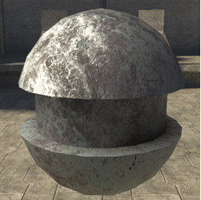
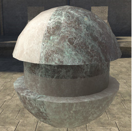
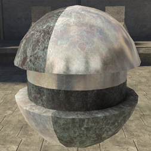
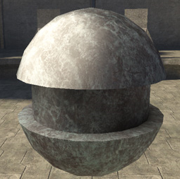
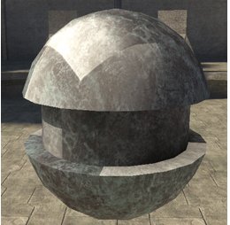
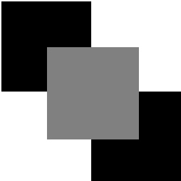
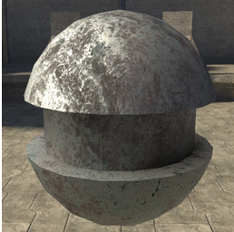

# Material Texture Properties

Available only in the cook_torrance material_model. Allows you to control specular coefficient, albedo blend, environment specular contribution and roughness on a per-pixel basis using the RGB and Alpha channels of the material texture bitmap.

You must check the use_material_texture box to activate the use of the material_texture bitmap. Checking this box disables some of the numeric value inputs.

> [!TIP]
> If you decide to use a material texture, you should remove the old specular alpha mask from your diffuse map— this will save you some texture memory.

## Red

Specular Coefficient (does not override the number value input).

You can think of this as the same thing as a specular mask, which is why you should remove it from the diffuse map.

Figure 1 - Diffuse map copied into the red channel.

- Black = no specular

- White = max specular as defined by the specular_coefficient and related parameters (area and analytical, but not environment_map, contributions).

## Green

Albedo Blend (overrides the number value input).

Figure 2 - Half black and half white.

- Black = specular uses tint color

- White = specular uses albedo color (tinted by the tint color)  

## Blue

Environment Specular Contribution (overrides the number value input).

Figure 3 - Half black and half white.

- Black = no environment.

- White = max environment.

## Alpha

Roughness (overrides the number value input).

- Black = sharp.

- White = wide.

Figure 4 - Uniform flat grey (medium roughness).

Figure 5 - Checker Map.

Figure 6 - Alpha Map used in figure 5.

> [!TIP]
> A good place to start is to copy and invert the specular (red) channel. This gives you tight highlights in the areas with the strongest spec values, which is how spec usually works.

Figure 7 - Spec map with inverted roughness map.
