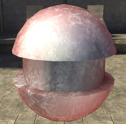
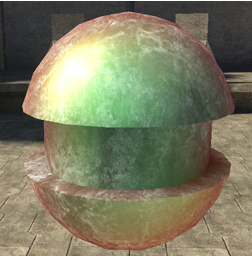

# Normal Specular Tint

The color of the specular lighting on mesh faces with normals pointing at the camera.

Figure 1 - normal_specular_tint: white (default)

Figure 2 - normal_specular_tint: [0,255,0]
