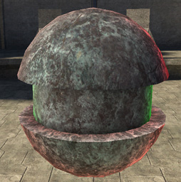
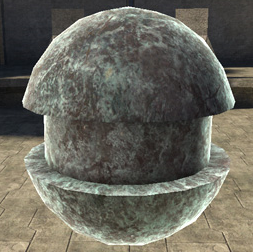
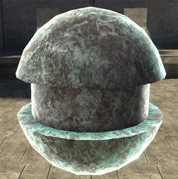
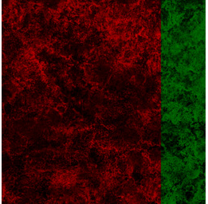

# Rim Maps Transition Ratio

Controls how much the rim specular is affected by the specular or diffuse maps.

- 1.0 = rim color from specular map

- -1.0 = rim color from diffuse

- 0 = rim color from rim parameters only.

Figure 1 - rim_maps_transition_ratio: 1

Figure 2 - rim_maps_transition_ratio: 0

Figure 3 - rim_maps_transition_ratio: -1

Figure 4 - Specular map used in figures 1 - 3
