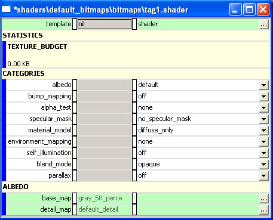

# Shaders Overview

All shader work is done in Guerilla.

An overview of the different sections of the shader tool follows Figure 1.

Figure 1 - A sample .shader tag with default settings.

## Template

It's no longer necessary to select a specific template for shaders. This is legacy from previous versions.

## Statistics

The texture_budget value shows how many kilobytes of memory the current configuration of the shader would use in-game.

## Categories

- albedo — (pronounced al-bee-doh) Defines the surface color

- bump_mapping— Defines variations in how lighting affects the surface

- alpha_test— Defines whether a pixel should be rendered or ignored

- specular_mask— Defines how specular properties are controlled on a per-pixel basis

- material_model— Defines what method is used to define specular properties

- environment_mapping— Defines what source is used for the environment map contribution to the specular properties

- self_illumination— Defines which pixels over-ride object lighting

- blend_mode— Defines how an object is added to the framebuffer (how it is blended with the objects behind it)

- parallax— Defines a special kind of bump mapping where pixels may occlude other pixels in the same map

## **Shaders Articles**

Select an article below to learn more about the specific topic.

## [*Albedo Properties*](Albedo.md)

## [*Albedo Blend Properties*](AlbedoBlend.md)

## [*Alpha Test Properties*](AlphaTest.md)

## [*Ambient Coefficient Properties*](AmbientCoefficient.md)

## [*Ambient Tint Properties*](AmbientTint.md)

## [*Analytical Anti-Shadow Control Properties*](AnalyticalAntiShadow.md)

## [*Analytical Specular Contribution Properties*](AnalyticalSpecular.md)

## [*Area Specular Contribution*](AreaSpecular.md)

## [*Blend Mode*](BlendMode.md)

## [*Bump Mapping Properties*](BumpMapping.md)

## [*Diffuse Coefficient*](DiffuseCoefficient.md)

## [*Diffuse Tint*](DiffuseTint.md)

## [*Double Multiply*](DoubleMultiply.md)

## [*Environment Map Coefficient*](EnvironmentCoefficient.md)

## [*Environment Mapping*](EnvironmentMapping.md)

## [*Environment Map Specular Contribution*](EnvironmentSpecular.md)

## [*Environment Map Tint*](EnvironmentTint.md)

## [*Environment Map Tint Color Properties*](EnvironmentTintColor.md)

## [*Fresnel Coefficient*](FresnelCoefficient.md)

## [*Fresnel Curve Bias Properties*](FresnelCurveBias.md)

## [*Fresnel Curve Steepness*](FresnelCurveSteepness.md)

## [*Glancing Specular Power*](GlancingSpecularPower.md)

## [*Glancing Specular Tint Properties*](GlancingSpecularTint.md)

## [*Material Model Properties*](MaterialModel.md)

## [*Material Texture Properties*](MaterialTexture.md)

## [*No Dynamic Lights*](NoDynamicLights.md)

## [*Normal Specular Power*](NormalSpecularPower.md)

## [*Normal Specular Tint*](NormalSpecularTint.md)

## [*Occlusion Parameter Map*](OcclusionParameterMap.md)

## [*Order 3 Area Specular*](Order3AreaSpecular.md)

## [*Parallax Properties*](Parallax.md)

## [*Rim Coefficient*](RimCoefficient.md)

## [*Rim Maps Transition Ratio*](RimMaps.md)

## [*Rim Power*](RimPower.md)

## [*Rim Start*](RimStart.md)

## [*Rim Tint*](RimTint.md)

## [*Roughness Properties*](Roughness.md)

## [*Self-Illumination Properties*](SelfIllumination.md)

## [*Specular Coefficient Properties*](SpecularCoefficient.md)

## [*Specular Map*](SpecularMap.md)

## [*Specular Mask Properties*](SpecularMask.md)

## [*Specular Power*](SpecularPower.md)

## [*Specular Tint*](SpecularTint.md)

## [*Standard Properties*](Standard.md)

## [*Subsurface Coefficient*](SubsurfaceCoefficient.md)

## [*Subsurface Map*](SubsurfaceMap.md)

## [*Subsurface Propagation Bias*](SubsurfacePropagation.md)

## [*Subsurface Tint*](SubsurfaceTint.md)

## [*Templates*](Templates.md)

## [*Terrain Overview*](Terrain.md)

## [*Transparence Coefficient*](TransparenceCoefficient.md)

## [*Transparence Map Properties*](TransparenceMap.md)

## [*Transparence Normal Bias*](TransparenceNormal.md)

## [*Transparence Tint Properties*](TransparenceTint.md)
