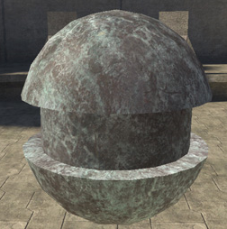
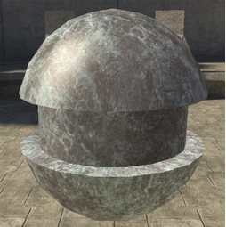
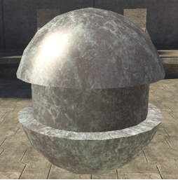
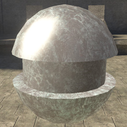
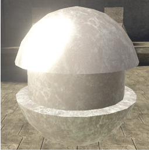

# Specular Coefficient Properties

Makes the shader more or less shiny.

Defined by a value from 0-1, but higher numbers can be entered for special effects. A value of zero will result in no specular at all.

The important thing to keep in mind is that this value contols overall specularity.

Figure 1 - specular_coefficient: 0.1

Figure 2 - specular_coefficient: 0.5

Figure 3 - specular_coefficient: 1

Figure 4 - specular_coefficient: 2

Figure 5 - specular_coefficient: 5
