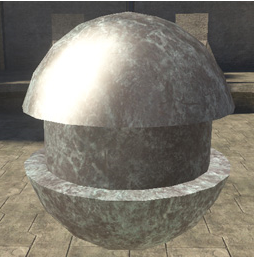
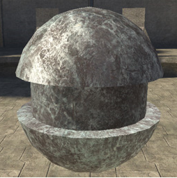

# Specular Mask

Specular Mask defines how specular properties are controlled on a per-pixel basis.

> [!NOTE]
> The specular properties (if any) are defined in the Material Model, this option simply defines where to find the mask. Regarding the grayscale values in the alpha channel (if used), white is maximum specularity as defined in the material_model properties, black is zero specularity.

There are three options for specular mask parameters:

## no_specular_mask

- **[no parameters]** — No per-pixel control of specular properties. This is the default setting. This will give you a constant specular highlight across the mesh, resulting in a very plastic look.

Figure 1 - no_specular_mask

## specular_mask_from_diffuse

- **[no parameters]** — Uses the alpha channel of the base_map in the albedo properties for per-pixel control of specular properties.  This option (and the one below) let you break up the specular highlight for a more realistic look.

Figure 2 - specular_mask_from_diffuse

## specular_mask_from_texture

- **specular_mask_texture** [bitmap] — Uses the red channel of the material_texture as defined in the cook_torrance material_model.
