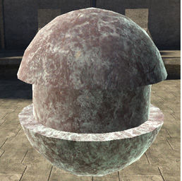
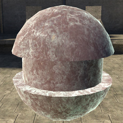
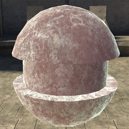
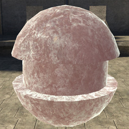

# Subsurface Propagation Bias

Controls size of the subsurface effect.

Figure 1 - subsurface_propagation_bias: 0

Figure 2 - subsurface_propagation_bias: 0.5

Figure 3 - subsurface_propagation_bias: 1

Figure 4 - subsurface_propagation_bias: 2
