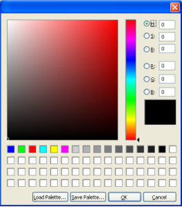
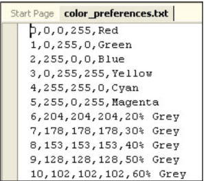
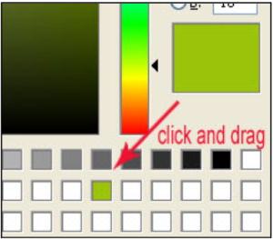

# Color Picker

The Color Picker available in Guerilla is similar to the one you might find in Photoshop. You can define the color you want by entering a numeric value in either HSB or RGB, or you can point and click to get the color you want. The Color Picker also allows you to save and load custom palettes (similar to the way color swatches work in Photoshop).

Figure 1 - The Color Picker

## How it Works

Figure 2 - the color_preferences.txt file format

All of the default color information for the swatches in the color palette is stored in a text file called **color_preferences.txt** which is located in **main\prefs**. There are five columns in the color_preferences file (see Figure 2):

- Swatch #— Each swatch is numbered (starting at 0) from left to right, top to bottom
- Red Value
- Green Value
- Blue Value
- Color Name/Comment— Each swatch can have a name/comment that appears when the user mouses over it

You can open the color_preferences.txt file in a text editor (such as Notepad, Visual Studio, etc.) and edit the color values and names to suit your needs, but creating a custom file (see below) would be better since the default color_preferences file gets updated by Source Depot.

Each time the Color Picker is closed, the color_preferences.txt file is automatically saved, so it remembers which colors you were working with previously (until you close and re-open Guerilla). The same is true for any custom color palettes you load into the color picker (see below for instructions).

## Create and Save a Custom Palette

You can create and save a custom color palette (or many different color palettes) by following these steps:

1. Open the Color Picker. The default values of the color preferences will be loaded into the palette.
2. Adjust the RGB or HSB values to create a color that you like (or drag the slider and click in the color window).
3. Click in the currently selected color swatch and drag it down to any swatch on the color palette (see Figure 3).  

Figure 3 - Click and Drag to add a color to the palette

4. Repeat with as many colors as you want to add to your custom palette. Remember, you can always drag one color over the top of another to replace it.
5. Click the **Save Palette** button in the bottom of the color picker window.
6. Navigate to the location you'd like to save your file, give it a memorable name, then click **Save**.

## Load a Custom Palette

You can load a previously saved custom color palette into the color picker by doing the following:

1. Open the Color Picker in Guerilla.
1. Click the **Load Palette** button.
1. Navigate to your custom palette text file, click to select it, and then click the **Open** button. Your palette should be loaded into the picker. 