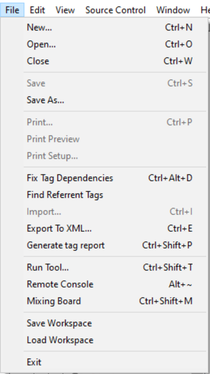
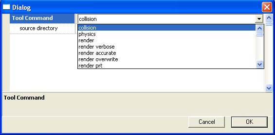

# File Menu

The File menu (see Figure 1) provides many of the commands you'll need to interact with tags, create tags, and import your work into the game engine. Below is a brief description of each of the commands on the file menu and what its functions are.

Figure 1 - Guerilla's File Menu

- **New** (Ctrl+N)— Opens the dialog for creating a new Tag.
- **Open** (Ctrl+O)— Brings up a chooser which lets you select a tag file to open and edit.
- **Close** (Ctrl+W)— Closes the currently opened and selected tag.
- **Save** (Ctrl+S)— Saves the tag which you are currently editing.
- **Save As**— Brings up a dialog which allows you to choose the name and location at which to save the tag you are currently editing.
- **Fix Tag Dependencies** (Ctrl+Alt+D)— Selecting this option builds a database of all tag references, checks to see which tags refer to a tag that doesn't exist, and then generates a report. From there, the user is given the option to remove the bad references or pick a new tag for those tags to refer to. For more information on this command, check out the [*Tag Dependency Information*](TagDependencyInfo.md) article.
- **Find Referrent Tags**— Generates a list of all tags which refer to the currently opened tag. Brings up a dialog box (see Figure 2) which displays the names and locations of the referring tags and gives the user the opportunity to open them. If you haven't yet generated a tag dependency database, running this command will do that for you. However, this could take a very long time, so be prepared to be unable to use your machine for the next half hour (give or take 10 minutes). See the [*Tag Dependency Information*](TagDependencyInfo.md) article for details on tag dependencies.

Figure 2 - The Find Referrent Tags Dialog.

- **Import** (Ctrl+I)— Imports a correctly formatted text file into guerilla as a tag.
- **Export** (Ctrl+E)— Exports all information in a tag to a text file.
- **Generate Tag Report** (Ctrl+Shift+P)— Generates a list of all debug output a tag will generate when run in the game engine.
- **Run Tool** (Ctrl+Shift+T)— Runs the program Tool.exe from within Guerilla. This command creates a dialog box (see Figure 3) with a drop down menu of all Tool commands. It is useful for (among other things) importing content created in a 3rd party program — such as Max or Maya — into the game engine.

Figure 3 - The Run Tool command dialog

- **Remote Console** (Alt+~)— Launches a telnet console connected to your currently connected Xbox. Allows you to run console commands via your PC rather than using a keyboard with your Xbox.
- **Mixing Board** (Ctrl+Shift+M)— Brings up a dialog which allows the user to launch either the sound or cinematic mixing board.
- **Save Workspace**— Allows you to save the layout and settings of your current Guerilla workspace. Your default workspace is saved at (PATH-TO-H3EK-DIRECTORY)\prefs\guerilla.cfg. This would be a good location to save any other workspace layouts.
- **Load Workspace**— Loads a previously saved custom workspace.
- **Exit**— Exits and closes Guerilla.
