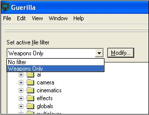
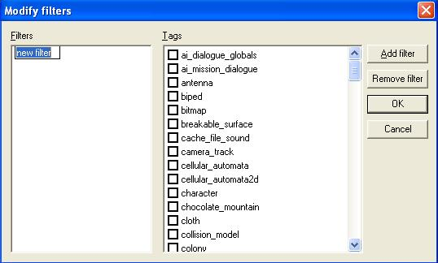

# Filters

Directly above the file tree in the left frame of the Guerilla window, is a drop down menu with text above it that reads "Set active file filter" (see Figure 1). Filtering allows the user to select and view only a specific set or type of tags— thus "filtering" out any tags you may not need or want to see.

Figure 1 - The Filter drop down menu.

## **To set up a filter**

1. Click the **Modify** button next to the drop down list. This will bring up the Modify Filters dialog box (see Figure 2).

Figure 2 - The Modify Filters Dialog

2. Click the **Add Filter** button. This will add an item in the Filters frame on the left called "New Filter." As you can see, the name of the filter is selected and can be changed to a name specific to the filter being created.

3. Check boxes in the Tags frame on the right for any tags you want to see displayed.

4. When you're finished selecting the tags to be displayed, click **OK**.

Once you've added a filter, it should appear in the drop down list in the main window. When you have the filter selected, you will still see all of the tags folders, but you will only be able to see tags of the type you selected when creating the filter. Any filters you create are stored in the (PATH-TO-H3EK-DIRECTORY)\prefs folder in a file called tag_filters.xml.
