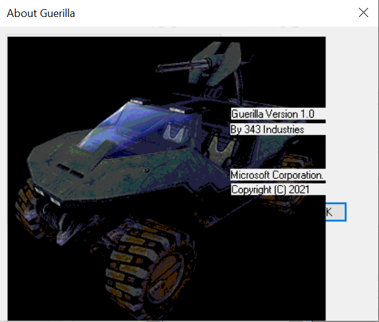

# Help Menu

The Help menu in Guerilla only contains one item: **About Guerilla**.

Selecting About Guerilla brings up a splash screen with information about the program (see Figure 1).

Figure 1 - Guerilla splash screen
