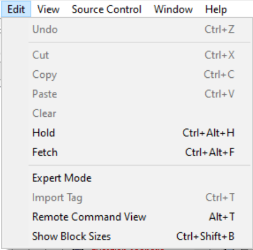

# Source Control

The Guerilla Source Control menu (see Figure 1) has various options for source control.

Figure 1 - Source Control Menu

- **Get Latest (Ctrl+G)**— Gets latest from Source Depot.
- **Sync & Check Out (Ctrl+K)**— Syncs and checks out the content.
- **Check In (Ctrl+U)**— Checks in the content.
- **Undo Check Out**— Undoes the checkout procedure for the item.
- **Show History**— Shows the history of what's been checked in and out.
- **Make Writeable**— Makes the item writable.
