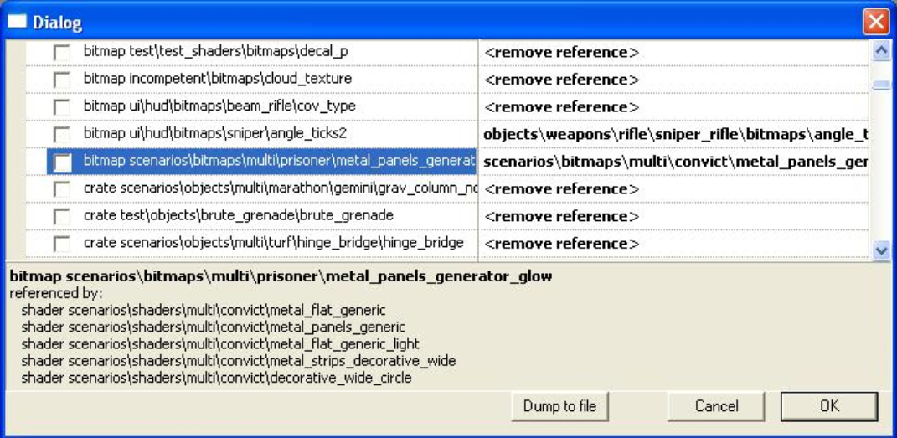
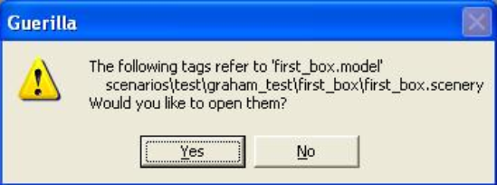

# Tag Dependency Information

Many tags in our engine read from or share information with other tags and must be linked with them to function correctly. These relationships are called *dependencies*. Through the course of development, tags get deleted, renamed, and moved. As that happens, it becomes handy to have a way of finding out which tags are no longer needed, or worse - which tags are no longer functioning correctly due to a broken dependency, thus causing problems in the game engine. To that end, Guerilla has a command called **Fix Tag Dependencies** that allows a user to see which tags have broken dependencies and then to either remove the dependency or choose a new tag to build a relationship with.

## Fixing Tag Dependencies

Here's how to find and fix broken tag dependencies:

1. Launch Guerilla.
1. Build the tag dependency information database. From the *File* menu, choose **Fix Tag Dependencies**. The first time you run this command it will take a very long time (maybe an hour). Guerilla builds a database of all tags with dependencies and then queries it for which tags have broken dependencies. When it's finished, a dialog similar to Figure 1 should appear.
1. The left column of the dialog contains the tag that is missing or has a problem. When you click on one of these tags, the bottom section of the dialog will display all the tags that refer to the missing one. The right column will contain either a suggested replacement, or *remove reference*. However, if you click in the right column, you can click on ... and choose your own replacement tag for the references.
1. Also of interest is the *Dump to File* button. If you'd like to see a text file of the list (perhaps to mail to other people who have tags to clean up), you can click *Dump to File*. This places a text file of all the broken tag dependencies in the root folder of your depot mapping (c:\halo3\branch_name).
1. Select the tag reference you want to remove or fix by clicking the check box next to it.
1. Click in the right-hand column and choose either **remove reference** if you want to remove the reference or ... to browse for the correct tag to refer the other tags to.
1. When you've made your choice, click **OK** to make the changes.

> [!NOTE]
> These changes will be placed in your current source depot changelist and will not be made permanent until you submit them to the depot.

Figure 1 - The Fix Tag Dependency Dialog

## Find Referrent Tags

There may be times when you want to know what tags refer (have dependencies) to the tag you're working with. This can easily be accomplished by doing the following:

1. Launch Guerilla.
1. Open the tag you want information about.
1. From the *File* menu, select **Find Referrent Tags**. Guerilla queries the tag dependency database for information about the currently opened tag. **If you haven't built the tag dependency database before, this will take a long time!** When it's finished, Guerilla will display a dialog similar to figure 2.

Figure 2 - The Find Referrent Tags Dialog
