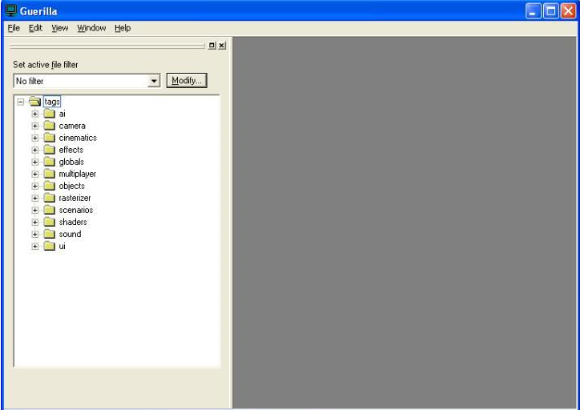

# User Interface

Upon launching Guerilla for the first time, the interface should appear similar to (see Figure 1). Along the left side of the window is a frame containing a list of folders, and on the right is a large empty area — this is where you will work with any open tags. It's important to note that the file tree on the left is a graphical representation of any tags files you have located at \halo3\main\tags on your hard drive. Guerilla always (and only) points to that specific location.

Figure 1 - The main Guerilla interface
