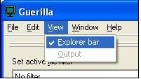

# View Menu

Guerilla has a very simple layout, so the view menu (see Figure 1) is also simple. There are only two options: Explorer Bar, and Output.

Figure 1 - Guerilla's View Menu

- **Explorer Bar** — Toggles the display of the file tree frame (the explorer bar)
- **Output** — If you need to know what this does, talk to Mat. Otherwise, don't worry about it
