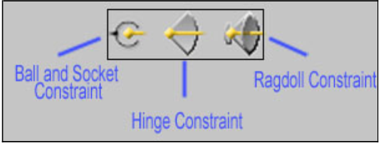
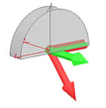
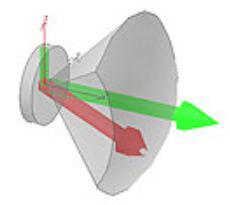
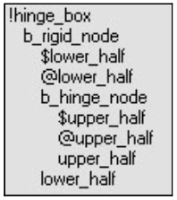

# Objects and Constaints

The only difference between a normal crate object and one set up with Havok, is that the Havok object uses constraints: hinges, ball and socket joints, and ragdoll. These are useful for setting up things like doors, swinging lights, and dead bodies— without having to define animations for them (as they move based on their physics).

> [!IMPORTANT]
> This section is built from the original documentation and is tailored for use in 3ds Max, but the important principles can be used in any 3d program.

> [!IMPORTANT]
> This section was originally built from the original documentation and was built with a plugin being used so some information may not be applicable.

## **Rigid bodies and constraints**

- All nodes which are a part of your object (except for the bang/world node) need to be **Rigid Bodies** in order for the Havok constraints to work. To apply a Rigid Body to your object, simply select the nodes and click on the button. This will assign a Rigid Body modifier to the stack for those nodes. In order to adjust the pivot space of your object (to make it move in the directions you want), you'll need to select the Modifier you created (hinge, for example) and then click on **Parent Space** to select it. This will enable you to move and rotate the axes (using the rotate tool) on which the havok constraints are located. It is important to note that "child space" is ignored, so you don't need to move it.

Figure 1 - Havok Constraints

- **Constraints** — What Havok uses to define the way a node with physics can behave. There are three types of Havok constraints: Ball and Socket, Hinge, and Ragdoll.

    - **Ball and Socket**

    - **Hinge**— A hinge constraint will allow the parts of the object linked to the node with the modifier to pivot on a single axis. This is similar to the hinge on a door. Figure 2 shows what the hinge gizmo looks like. The red and green arrows are aligned along the axis in which the hinge will pivot. The flat end of the arrow (at a 90° angle to the arrow itself) rests along the starting point of the object's movement. The gray shaded area is the distance that the object will pivot (the angle that the pivot is constrained to).

    - **Ragdoll** — A Ragdoll constraint will allow the parts of the object linked to the node with the modifier to pivot and rotate along multiple axes. As you can see in Figure 3, the movement on a ragdoll constraint is similar to that of a joint on a human skeleton. You can adjust the size of the cone and the amounts of twist that the ragdoll will perform.

|||
|---|---|
|Figure 2 - The Hinge constraint gizmo|Figure 3 - The Ragdoll constraint gizmo|

> ![NOTE]
> High amounts of twist will create an unstable ragdoll. Start with it low at first and then turn it up as needed.

## **Step-by-step setup**

1. Create the geometry for your Havok object in Max, including the render, collision, and physics.

2. Create a frame node for the portion of your object that will not be moving and link the geometry to it.

3. Next, create a frame node for the portion of the object that you want to move, and link the moving geometry to it.

4. Link the frame node for the moving geometry to the frame node for the unmoving geometry.

5. Create a bang (or world) node and link the root frame node to it. At this point, your object nodes should look like figure 5.

6. Nodes that are part of a havok object need to be rigid bodies. Select the two nodes of your object. Click on the **Rigid Body** button on the Havok toolbar to assign a Rigid Body modifier to the stack for both nodes.

7. Now select only the node for the part of the object that you want to move. Click on one of the Havok constraints to assign a type of motion constraint to it (for this example, we're using a hinge constraint). This will add a constraint modifier to the top of the stack for that node.

8. Select the Constraint modifier in the stack for your node. In the *Constraint Spaces* rollout, make sure that the **Lock** checkboxes (for both parent and child spaces) are not checked.

9. In the Constrain To rollout, make sure that the **Parent Rigid Body** radio button is selected and that your other node (the rigid one that you don't want to move) is listed on the button. If it is not, click on the button and select the other node.

10. In the *Properties* rollout, check the **Is Limited** checkbox and set the limitations on the constraint so that it will move the way you want it to.

11. In order to adjust the pivot space of your object (to make it move in the directions you want), you'll need to select the Modifier you created (hinge, for example) and then click on **Parent Space** to select it. This will enable you to move and rotate the axes (using the rotate tool) on which the havok constraints are located. It is important to note that "child space" is ignored, so you don't need to move it.

12. Save and export your object.

13. Import your object in Guerilla, create a crate tag for it, and link the crate tag to the .model tag.

||
|--|--|
|Figure 4 - The Hinge Constraint rollouts|Figure 5 - The Node Hierarchy for a simple hinged object|
