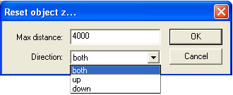
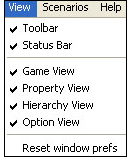

# Sapien Overview

Sapien is our main interface for editing a scenario (MP and Campaign maps or Cinematic BSPs). This includes placing objects, decals, lighting, characters, vehicles, and setting up encounters with friendly and enemy AI.

For detailed information about Sapien's various features, visit these articles:

## User Interface

### Menus

- **File** (see Figure 1)— Provides access to the following commands:
    - **New**— Creates new file.
    - **Open Scenario** (Ctrl+O)— Brings up an open dialog, which allows you to open a scenario. Opening a different scenario automatically closes the currently open one.
    - **Save Scenario** (Ctrl+S)— Saves your scenario.
    - **Save Scenario As**— Brings up a dialog which allows you to re-name your scenario and/or save your scenario to a different location.
    - **Compile Scripts** (Ctrl+Shift+C)— Compiles any scripts you have written in HaloScript to attach to the current scenario.
    - **Export Script Names** (Ctrl+Shift+E)— Exports script names associated with the scenario to a file called hsc_scenario.syninc (places it in main folder you've mapped your depot to).
    - **Xbox Sync** (Ctrl+Shift+S)— Syncs all of the files in your \tags\... directories to your Xbox.
    - **XSync Scenario** (Ctrl+Shift+F)— Syncs only the currently open scenario to your Xbox.
    - **Connect to Xbox** (Ctrl+Shift+X)— Brings up a dialog which allows you to enter the name or IP address of an Xbox to connect to in order to sync files or run commands.
    - **Reboot Xbox** (Ctrl+Shift+R)— Reboots the Xbox you are currently connected to.
    - **Reboot Xbox to Game** (Ctrl+Alt+R)— Reboots the Xbox you are currently connected to and launches the tagdebug.xbe (executable).

Figure 1 - Sapien's File Menu

- **Edit** (see Figure 2)— Provides access to the following commands:
    - **Switch BSP** (Ctrl+B)— Scenarios can contain multiple BSP's (Binary Space Partitions). This command brings up a dialog (Figure 3) with a drop down list which allows you to switch to a different BSP in the Game Viewer.
    - **Drop Objects** (Ctrl+D)— Currently non-functional.
    - **Expert mode** (Ctrl+Alt+Shift+X)— unlocks use of some fields in the properties palette that are otherwise unusable. Don't turn this on unless you know what you're doing, or someone else has told you exactly what to do with it.
    - **Reset Object Z** (Ctrl+Alt+Z)— Resets the object's Z-plane coordinate to zero. You can set a maximum distance that the reset command will work within. For example, you can set the Max Distance property to 3 and if your object is greater than 3 WU away from 0 on the z axis, Reset Z will ignore the object (this is handy when selecting and moving multiple objects). You can also choose to only move objects either up or down along the z-axis to zero. So, if you select up and your object is above 0 on the z-axis, your object won't be moved.
    - **Copy Object Transform** (Ctrl+K)— Copies the exact position and orientation of a selected object within your scenario to the clipboard.
    - **Apply Object Transform** (Ctrl+L)— Pastes a selected object to the exact position and orientation of a previously copied object from the clipboard. Be careful with this one: it pastes the object exactly over the top of the copied object, so in order to see your pasted object, you'll have to select it and move it.
    - **Hexidecimal Mode**— Changes some numbers (such as unique ID's for objects) to hexidecimal format.
    - **Clear Output Window**— Clears the Output Window of any messages/error logs.

Figure 2 - Sapien's Edit Menu

Figure 3 - The Switch BSP Dialog

Figure 4 - The Reset Object Z Dialog

- **View** (see Figure 5)— Provides access to the following commands:
    - **Toolbar**— Toggles the toolbar on/off (checkmark next to the command signifies on).
    - **Status Bar**— Toggles the Status Bar (the bar that runs along the bottom of the sapien window and provides helpful tips about commands) on or off.
    - **Game View**— Toggles the Game View window on and off.
    - **Property View**— Toggles the Properties Palette window on or off.
    - **Hierarchy View**— Toggles the Hierarchy View window on and off.
    - **Tool View**— Toggles the Tool Window on and off.
    - **Reset Window Prefs**— Resets the Sapien Windows settings to the default settings. The window arrangement you have upon closing sapien will be saved in your preferences.

Figure 5 - Sapien's Edit Menu

- **Scenarios** (see Figure 6)— Provides access to the following commands:

    - **Run Game Scripts** (Alt+G)— Attempts to run any scripts you have included with the scenario.
    - **Map Reset** (Alt+R)— Resets the map to the state it is in upon startup/launch.
    - **Generate all Pathfinding Data**— Creates pathfinding data for all of the AI placed in the scenario. This command needs to be run before AI will be able to move.
    - **Split Mission Resources** (Ctrl+Shift+P)— Splits up the scenario into various resource tags, which make it possible for multiple people to work on different aspects of the scenario at the same time. Running this command creates a Resource directory in the root folder of your scenario and places the new resource tags in it. Once the command is run, opening the .scenario tag will still show the whole scenario but you'll need to check out individual resource tags in order to edit them.
    - **Split Mission Scripts**— Performs the same function as Split Mission Resources, but instead of splitting resources, it splits scripts out of the .scenario tag and gives them their own scripts directory in the root folder of your scenario (in \tags\). IMPORTANT: After you run Split Mission Scripts, you won't be able to add new scripts to the scenario by simply saving them in the correct location in \data\ and compiling. Because (after splitting) the scripts are now in their own resource tags, you need to run Add Mission Script to create a new script tag, then compile the script to get it to run correctly in your scenario.
    - **Add Mission Script**— Only available after running Split Mission Scripts. Brings up a dialog which allows you to choose a script, then it creates a .scenario_hs_source_file in your \tags\scripts directory. You will still need to compile scripts to get the new script to run in your scenario. After you've run split mission scripts, this is the only way to add a script to your scenario.
    - **Split Mission AI**— Like the Split Mission Scripts and Split Mission Resources commands, Split Mission AI separates the AI tags from the .scenario tag and places them in two categories: cinematic and mission. Again, this is mainly so that multiple people can work on the AI at the same time.
    - **Set Active Mission AI**— After you've run Split Mission AI, this command is used to set which AI are part of the mission AI and which are part of cinematic AI.
    - **Import Comments** (Ctrl+Shift+L)— It is possible to set comments at semi-precise locations while playing your scenario in-game. After doing so, you can import them into your scenario using the Import Comments command. For example, a designer is walking through their level and they see a single tree placed upside down. They make a comment, then import comments in Sapien and they can easily find the location of the offending tree.
    - **Sync Mission**(Ctrl+I)— Gets the latest version of the current scenario from source depot.
    - **Submit Mission** (Ctrl+U)— Checks a scenario back into the depot (if you had it checked out for editing).

Figure 5 - Sapien's Scenario Menu

- **Help**— 

