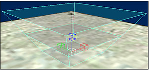

# Placing Lights

To place a light in a scenario using Sapien, do the following:

1. Launch your scenario in Sapien
2. In the Hierarchy View window, expand the Mission folder, then the Lighting Data folder. Click on the Lights folder to highlight it.
3. In the Hierarchy View window, click the Edit Types button.
4. From the drop-down list in the Asset Type Palette, select the type of object you want to add. Click the Add button
5. Find the tag for the light you want and click Add Tags. Click Done and then OK to close the asset type palette.
6. Now that you've added the light to your scenario, it's time to place an instance of it. In the Hierarchy View window, click the category of object you just added to highlight it (if it isn't already selected).
7. In the Game Window, right-click to place a light. A generic light object (see Figure 1) will appear in the Game Window. In the Hierarchy View, you'll notice that a new light object has been added to the list, but under type it says none. You still need to set the type of the light in the Properties Palette window.

Figure 1 - A Generic light object placed in the scenario.

8. With your light still selected (you can click on its entry in the Hierarchy View Window to be sure), click the Type drop down menu (see Figure 2) in the Properties Palette window. Select the type of light you added to your palette.

Figure 2 - The Type drop down menu in the Properties Palette window.

9. Once you've selected a type, you should see your particular light appear in the Game Window (although some lights simply remain the same shape as the generic one). For information on how to move, scale, or rotate your object, see the Asset Manipulation Gizmo article.
10. Save your scenario.
11. If you're connected to an Xbox, you should Xsync (shift-ctrl-s) and look at the object you just placed in your scenario in-game.

## Resizing and Positioning a Light

Most aspects of a light object can be controlled using the [*Asset Manipulation Gizmo*](AssetManipulation.md), including the size, shape, and brightness planes. However, in order to adjust all these properties, the light first needs to be set as **Custom Geometry** — otherwise you'll be limited to simply rotating and moving it. You can set a light as custom geometry by clicking the **Custom Geometry** checkbox in the *Flags* section of the Properties Palette window (see Figure 3).

Figure 3 - The Custom Geometry Flag

After your light is set as custom geometry, its blue lines turn green and it has two Manipulate gizmos (instead of just one). Now you can hold down the alt key to adjust the height of the light planes, and hold down the ctrl key to adjust the size of the light cone. Press shift to access the Manipulate gizmo's rotate handles. Also, remember that you can adjust any of these properties in the [*Properties Palette*](PropertiesPalette.md) window with more precision.
