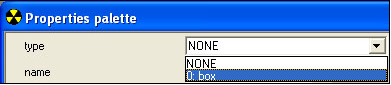

# Placing Objects

To place an object in a scenario using Sapien, do the following:

1. Launch your scenario in Sapien.
2. In the Hierarchy View window, expand the Mission folder, then the Objects folder. Click on the category of object (Scenery, Crate, Creature, Device, etc.) you want to add to highlight it.
3. In the Hierarchy View window, click the **Edit Types** button.
4. From the drop-down list in the [*Asset Type Palette*](HierarchyView.md), select the type of object you want to add then click the **Add** button
5. Find the tag for the appropriate object and click **Add Tags**. Click **Done** and then **OK** to close the asset type palette.
6. Now that you've added the object to your scenario, it's time to place an instance of it. In the Hierarchy View window, click the category of object you just added to highlight it.
7. In the Game Window, right-click to place an object. You'll notice that when the object is placed, an entry appears in the hierarchy view (with Type: None), but in the Game Window only the manipulate gizmo appears. This is because you need to tell Sapien what the type of the object is you just placed.
8. With your object still selected (you can click on its entry in the Hierarchy View Window to be sure), click on the **Type** drop down menu (Figure 1) in the **Properties Palette** window. Select the object you added to your palette. If your object doesn't appear, you most likely added an object from the wrong category in the Hierarchy View.

Figure 1 - The Type drop down menu in the Properties Palette window

9. Once you've selected a type, you should see your object appear in the Game Window. For information on how to move, scale, or rotate your object, see the [*Asset Manipulation Gizmo*](AssetManipulation.md) article.
10. Save your scenario.
11. If you're connected to an Xbox, you should Xsync (shift-ctrl-s) and look at the object you just placed in your scenario in-game.
