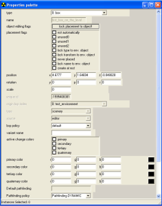

# Properties Palette

The Properties Palette window in Sapien (see Figure 1) allows you to edit a myriad of properties for every asset you place within your scenario. It is completely contextual, so the properties change based on the asset you have selected in the Hierarchy View. The properties palette shown in Figure 1 is an example of what the palette looks like with a simple box object selected. See individual articles for information on which properties need to be configured for your asset to work correctly.

You may notice that some blocks of the properties palette are greyed out. This is for your safety and protection, but if you must edit one of those properties (and you know what you're doing), you can access them by turning on **Expert Mode** in the Edit menu.

Figure 1 - The Properties Palette Window
