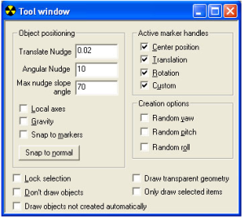

# Tool Window

The Tool Window shows the properties for Sapien's [*Asset Manipulation Gizmo*](AssetManipulation.md). It allows you to change the way the gizmo functions in selecting and positioning various assets within your scenario.

## Controls

**Object Positioning**

- **Translate Nudge**— Currently not supported, does nothing.
- **Angular Nudge**— Currently not supported, does nothing.
- **Max Nudge Slope Angle**— Currently not supported, does nothing.
- **Local Axes**— Sets the axes on the manipulate gizmo to match the rotation of assets. If this is not checked, the Manipulate gizmo axes are positioned universally and don't move with changes to an asset's position.
- **Gravity**— Disables the translation (move) handles on the manipulate gizmo.
- **Snap to Markers**— Currently not supported, does nothing.
- **Snap to Normal**— Snaps the Pitch (P) and Roll (R) axes to 0.

Active Marker Handles

- **Center Position**— Enables/Disables use of the grey box center handle (free move) of the manipulate gizmo.
- **Translation**— Enables/Disables use of the translation/move handles (Green, orange, and purple boxes) of the manipulate gizmo.
- **Rotation**— Enables/Disables use of the rotation handles (yellow, magenta, and turquoise triangles) of the manipulate gizmo.
- **Custom**— Only used when setting trigger volumes. Checking this flag allows you to resize particular faces of trigger volumes (otherwise you can only scale the whole volume).

**Creation Options**

- **Random Yaw**— When this box is checked, any asset placed in the scenario (via right-click) will be placed with a randomly generated yaw setting.
- **Random Pitch**— When this box is checked, any asset placed in the scenario (via right-click) will be placed with a randomly generated pitch setting.
- **Random Roll**— When this box is checked, any asset placed in the scenario (via right-click) will be placed with a randomly generated roll setting.

**View Options**

- **Lock Selection**— Locks the currently selected asset so that you can't accidentally select another asset.
- **Don't Draw Objects**— Disables drawing objects in Sapien.
- **Draw Objects Not Created Automatically**— For objects, it is possible to set a "Not automatically" flag in the Properties Palette. This command causes those objects to render in the Game Window. This is a legacy command that was due to Sapien not being able to handle rendering all objects (not necessary now).
- **Draw Transparent Geometry**— Renders transparent geometry— such as glass— in the Game Window. Not a necessary setting anymore because transparent geometry is automatically rendered (although it is currently rendered opaque).
- **Only Draw Selected Items**— Only Renders (draws) the currently selected asset in the Game Window.
