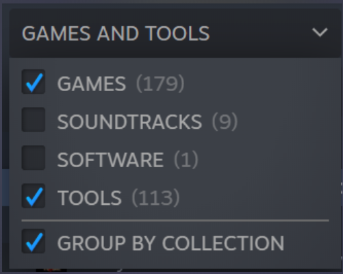
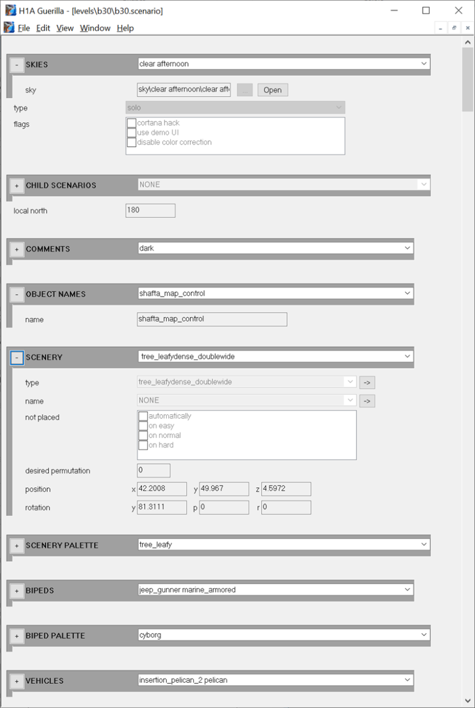
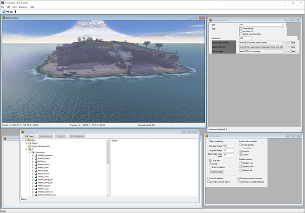

# Tools Overview for Halo: The Master Chief Collection
Modding tools for Halo: CE, Halo 2, and Halo 3 can be downloaded via Steam. When the tools are updated, be sure to re-extract the latest tags.zip file.  When the tools are updated, you should re-extract the latest HEK.7z for each tool kit. You can use the Extract batch file to perform this action for you, which also allows you to choose what action to perform with each extracted file in relation to any existing files you may have, allowing your mods to remain compatible with the latest version of the tools. 

These tools are being provided **as-is**.

Licensing for the Halo: CE mod tools remains open to anyone who is interested in creating content for Halo: CE. For Halo 2 and Halo 3, you will need to own a license to the base game in Steam to gain access to the tools. The Halo: CE mod tools are available to anyone, regardless of which titles they own in Halo: MCC. To acquire the current mod tools, you can click the following links to install them if you own the DLC that matches the Toolset (ex. Halo 3 DLC for MCC would be entitled to Halo 3 Mod Tools):

- [Halo: Combat Evolved Steam Page](https://store.steampowered.com/app/1532190)
- [Halo 2 Steam Page](https://store.steampowered.com/app/1613450)
- [Halo 3 Steam Page](https://store.steampowered.com/app/1695791)

Or, alternatively, within the Steam app, in your Library, you can locate "Halo: CE Mod Tools - MCC" "Halo 2 Mod Tools - MCC" or "Halo 3 Mod Tools - MCC" and select to install with your Library filter set to include "Tools" as shown below.

With this download, there are several programs that everyone will have access to. If you've modded in the Halo community before, some may be easily recognized. We also created an entirely new one to make modding Halo even easier. The screenshots below are specific to Halo: CE modding tools, though these tools function similarly in Halo 2 and Halo 3 as well.

## Guerilla

*"Guerilla" – Viewing the scenario tag for "The Silent Cartographer"*

This program is used to edit the values of game content, which are files collectively called "tags." There are tags for AI, bipeds, textures (aka, bitmaps), etc. You can use this program to update and alter these.

## Sapien

*"Sapien" – Viewing the level for "The Silent Cartographer"*

This one is the world or level editor for the game. Internally, levels are referred to as "scenarios." This program allows you to populate data related to the level itself including things such as weapon placement, AI squads, and more.

## Tool
Though basic in its name, this one is a command-line-only Swiss Army knife for very specific changes. This is used to perform all the tasks related to importing source content into tag files or even to building map files. These map files are internally referred to as 'cache files.' But this tool will help perform all these adjustments.

## Standalone
This entirely new program is basically a development build of the game itself. It runs directly off tag files instead of cache files. This is largely meant to help improve iteration times for people who are building and modding content. This program is meant for advanced modification only. It is also targeted for non-multiplayer development only. You can't use it to test multiplayer levels with others and it won't even load multiplayer levels at this moment. You could load multiplayer levels as campaign levels, but it may or may not help you in your endeavors for it.

For this tool, do not expect all the bells and whistles. This is very much a what you see is what you get sort of tool.

## Additional Tools
In addition to these programs, we are also including data files of level scripts and all the tag files which go into building the campaign and multiplayer levels. To access these, you will need to extract these files using the Extract batch file to begin editing these files or building existing levels. Part of the reason for using zips is so the final tools package is smaller to download, but also so tool updates don't inadvertently replace files you edit.

These tools are being provided **as-is**. While we plan to make updates over time to address issues we see the community talking about, the level of support these tools get should not be expected to match MCC itself. These are the tools which developers used or are using. They were originally developed with the expectation that a programmer was never too far away to fix or help someone work around an issue. They can be used in many ways, but not all workflows may work as expected on your machine. Future updates made to MCC may require you to rebuild your maps to play properly. However, we do not intend to break compatibility of tag files with tool updates, at least not without fair warning where possible. Halo: Combat Evolved, specifically, does not have a flexible tag system that can handle format changes gracefully. Later games improved this aspect. So, if such times come, all you *should* need to do is have the latest tools and rebuild your map. In order to take advantage of changes we make to the games; you *may* also need to update tags you use. Especially if you are using stock tag files (ones which are used to make the stock campaign and multiplayer levels), as these may have been changed to address bugs or other support items. We hope you enjoy these new ways to interact with Halo and we look forward to hearing from the community on your modding endeavors. Happy Modding all!
